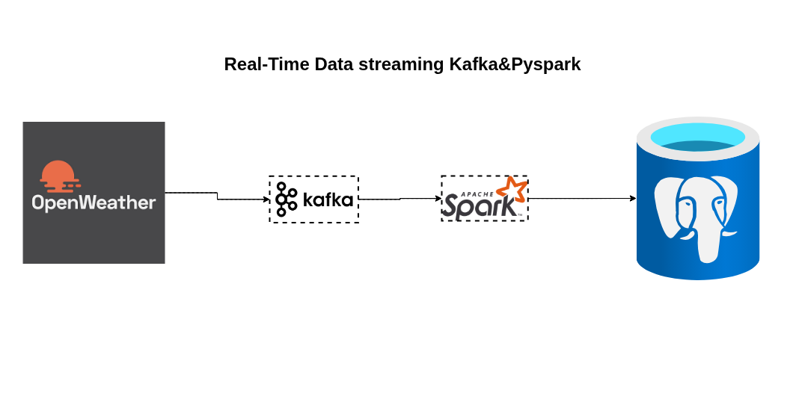

# Real-Time Weather Data Streaming with Kafka and PySpark

## Overview
This project demonstrates an end-to-end real-time data pipeline:
1. Fetches weather data from [OpenWeather API](https://openweathermap.org/api).
2. Sends data to Kafka topics using a Python producer.
3. Reads data with PySpark Structured Streaming.
4. Writes processed data to PostgreSQL for further analysis.

## Architecture


## Features
- Real-time ingestion and processing of weather data.
- Streaming with PySpark for scalable and fault-tolerant pipelines.
- PostgreSQL integration for storage and analytics.

## Requirements
- Python 3.10+
- Kafka
- PostgreSQL
- PySpark
- Python packages: `kafka-python`, `pyspark`, `psycopg2`, `requests`

## Setup & Usage

### 1. Start Kafka
```bash
# Start Zookeeper
zookeeper-server-start.sh config/zookeeper.properties

# Start Kafka broker
kafka-server-start.sh config/server.properties
